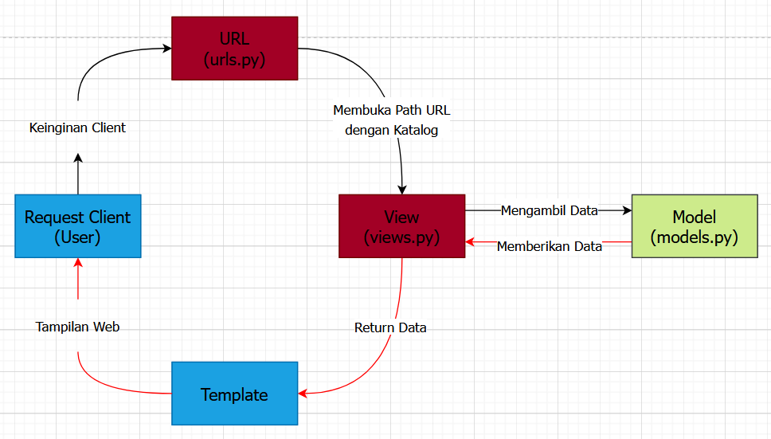

# Tugas 2 PBP README.md
### Muhammad Rafialy Farrel
### 2106751171
### PBP-A

#

### [Link Aplikasi Heroku](https://bismillahgol.herokuapp.com/katalog/)



## Penjelasan Alur

Tahap pertama dari alur program Tugas 2 ini adalah user/client memberikan request yang diproses oleh ```urls.py``` untuk mendefinisikan alamat URL. Pada tahap kedua ```urls.py``` melanjutkannya ke fungsi ```views.py``` yang sudah sesuai dengan url. Pada tahap ketiga ```views.py``` mengambil data dari ```models.py``` yang akan ditampilkan dan disesuaikan dengan ```katalog.html```. Setelah data sudah terisi ke dalam ```katalog.html``` akan diteruskan ke user/client berupa HTTP.

## Jelaskan kenapa menggunakan virtual environment? Apakah kita tetap dapat membuat aplikasi web berbasis Django tanpa menggunakan virtual environment?
Pada mata kuliah PBP ini disarankan untuk menggunakan python sebagai virtual environment. Anggap virtual environment sebagai basis dari sistem operasi yang saya gunakan, jika kita menggunakan basis yang berbeda-beda dalam sebuah project akan menyebabkan project menjadi error/crash. Oleh sebab itu, virtual environment sangat dibutuhkan sebagai wadah untuk memisahkan dari basis yang kita punya.

## Jelaskan bagaimana cara kamu mengimplementasikan poin 1 sampai dengan 4 di atas

### ```urls.py```
```
app_name = 'katalog'

urlpatterns = [
    path('', show_katalog, name = 'show_katalog'),
]
```
Pada ```urls.py``` di dalam folder ```katalog``` berisikan variabel ```urlpatterns``` yang berfungsi untuk mendefinisikan path ```show_katalog``` yang akan digunakan di dalam ```views.py```.

```
urlpatterns = [
    path('admin/', admin.site.urls),
    path('', include('example_app.urls')),
    path('katalog/', include('katalog.urls')),
]
```
Pada ```urls.py``` di dalam folder ```project_django``` berisikan path katalog yang akan digunakan pada ```katalog\urls.py``` dan menambahkan ```katalog/``` pada bagian akhir URL yang akan digunakan oleh user/client.

## ```views.py```
```
def show_katalog(request):
    data_barang_catalog = CatalogItem.objects.all()
    context = {
        'list_barang' : data_barang_catalog,
        'nama' : 'Muhammad Rafialy Farrel',
        'id' : '2106751171',
    }
    return render(request, "katalog.html", context)
```
Pada ```views.py``` di dalam folder ```katalog``` membuat variabel ```data_barang_catalog``` yang akan memanggil semua object yang ada di ```katalog\models.py``` dan menambahkan variabel ```context``` yang berisi variabel ```list_barang```, ```nama```, dan ```id``` dan akan di return ke ```katalog.html```.

## ```katalog.html```
```
...

    <tr>
        <th>{{item.item_name}}</th>
        <th>{{item.item_price}}</th>
        <th>{{item.item_stock}}</th>
        <th>{{item.rating}}</th>
        <th>{{item.description}}</th>
        <th>{{item.item_url}}</th>
    </tr>
...
```
Pada ```katalog.html``` menambahkan `````` untuk mengambil data yang berada di variabel ```list_barang``` dan menyusunnya sesuai kode di atas. Kode yang berada di dalam ```katalog.html``` akan divisualisasikan kepada user/client.

## ```Deploy```
Pada template ini, deployment dilakukan dengan memanfaatkan GitHub Actions sebagai runner dan Heroku sebagai platform Hosting aplikasi. Untuk melakukan deployment, kamu dapat melihat instruksi yang ada pada Tutorial 0. Untuk contoh aplikasi Django yang sudah di deploy, dapat di akses pada url ```https://django-pbp-template.herokuapp.com/katalog/```.

## Referensi
1. https://pbp-fasilkom-ui.github.io/ganjil-2023/assignments/tutorial/tutorial-0
2. https://pbp-fasilkom-ui.github.io/ganjil-2023/assignments/tutorial/tutorial-1
3. https://github.com/pbp-fasilkom-ui/assignment-repository
