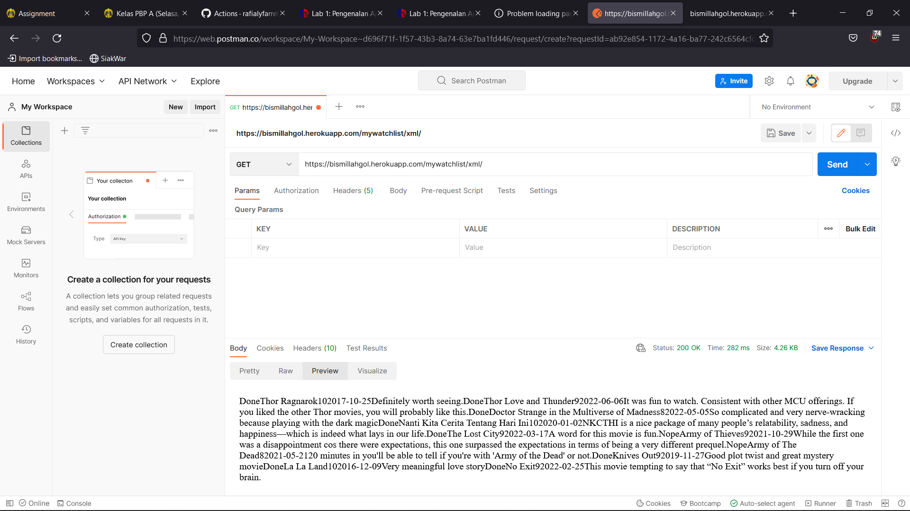

# Tugas 3 PBP README.md
### Muhammad Rafialy Farrel
### 2106751171
### PBP-A

#

## 1. Jelaskan perbedaan antara JSON, XML, dan HTML!

### a). JSON (Java Script Object Notation)
        JSON merupakan sebuah format yang digunakan untuk menyimpan, membaca, serta menukar informasi dari web server sehingga dapat dibaca oleh para pengguna. JSON terdiri dari 2 
        struktur yaitu berupa kumpulan value yang berhubungan seperti object dan kumpulan value yang berurutan seperti array. Kelebihan JSON dapat menyimpan data berupa array.

### b). XML (Extensible Markup Language)
        XML digunakan untuk  mengangkut data dari satu aplikasi ke aplikasi lain melalui internet sehingga XML lebih sering digunakan untuk mentransfer data.

### c). HTML (Hypertext Markup Language)
        HTML digunakan untuk mengelola data yang ada dan menampilkannya melalui web sehingga HTML digunakan untuk menyajikan data sesuai dengan format yang diinginkan.

## 2. Jelaskan mengapa kita memerlukan data delivery dalam pengimplementasian sebuah platform?
      Dalam pengimplementasian sebuah platform kita memerlukan data delivery karena kita akan membuat dan mengirimkan data yang memiliki format berbeda. Format yang digunakan
      seperti JSON, XML, dan HTML.

## 3. Jelaskan bagaimana cara kamu mengimplementasikan checklist di atas.

### a). Membuat folder ```mywatchlist``` 
        Membuat folder ```mywatchlist``` menggunakan command ```python manage.py startapp mywatchlist``` di cmd/terminal yang nantinya akan diisi dengan file-file yang dibutuhkan.

### b). Menambahkan aplikasi ```mywatchlist```
        Menambahkan aplikasi mywatchlist ke dalam variabel ```INSTALLED_APPS``` di dalam file ```project_django\settings.py```.

### c). Menambahkan kode pada file ```mywatchlist\models.py```
```
class Movies(models.Model):
    watched = models.TextField()
    title = models.TextField()
    rating = models.IntegerField()
    release_date = models.DateField()
    review = models.TextField()
```
Kode tersebut ditambahkan untuk mendefine models yang terdiri dari data yang ingin di input. Selanjutnya, menjalankan command ```python manage.py makemigrations``` untuk 
mempersiapkan migrasi skema model ke dalam database Django lokal. Lalu, Menjalankan command ```python manage.py migrate``` untuk menerapkan skema model yang telah dibuat 
ke dalam database Django lokal.

### d). Membuat folder bernama ```fixtures``` di dalam folder aplikasi ```mywatchlist``` dan membuat file bernama ```initial_mywatchlist_data.json``` 
        Pada file ```initial_mywatchlist_data.json``` berisikan kode berupa data 10 film sesuai dengan isi dari variabel yang berada di file ```mywatchlist\models.py```.
        Lalu, menjalankan perintah ```python manage.py loaddata initial_mywatchlist_data.json``` untuk memasukkan data tersebut ke dalam database Django lokal.

### e). Membuat file ```mywatchlist\templates\mywatchlist.html```, ```mywatchlist\urls.py```, dan menambahkan beberapa potongan kode pada file yang berada pada folder ```mywatchlist```
        Membuat file ```mywatchlist.html``` untuk mendesain tampilan yang akan dilihat oleh user nantinya. Selanjutnya, menambahkan kode pada ```views.py``` supaya dapat digunakan
        dengan format JSON, XML, dan HTML. Lalu, menambahkan path untuk JSON, XML, dan HTML pada file ```mywatchlist\urls.py``` yang telah dibuat sehingga nantinya halaman JSON, XML, 
        dan HTML dapat ditampilkan lewat browser. Lalu, melakukan command ```python manage.py runserver``` dan menjalankan URL yang berada di Tugas 3.
 
## Menambahkan kode ke dalam file ```mywatchlist\test.py```
   Menambahkan kode untuk menguji URL JSON, XML, dan HTML memberikan respon ```HTTP 200 OK``` saat di jalankan.

## Screenshot akses URL JSON, XML, dan HTML di Postman
   
   
   
   

## Mengerjakan Bonus
   Bonus dengan menambahkan pesan sesuai dengan kondisi yang ada, yaitu di saat film yang telah ditonton lebih banyak dibandingkan dengan film yang belum ditonton dan sebaliknya.
